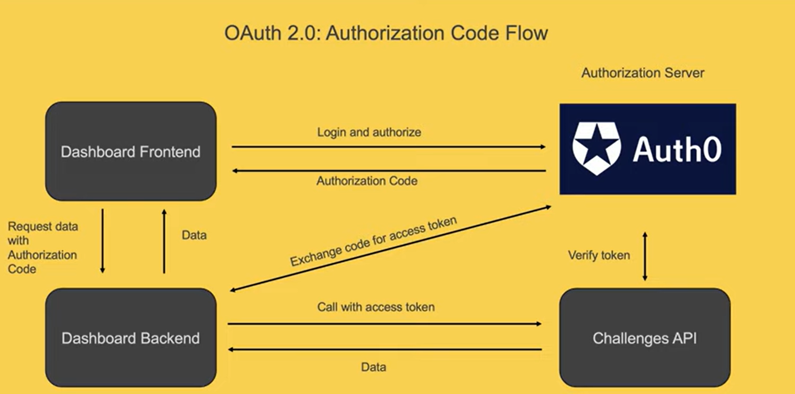

# Crash Course: Web Api Design

[Playlist](https://www.youtube.com/watch?v=hkXzsB8D_mo&list=PLP_rkG1reBjrCKy2Pb1bvjJKbKfantijk)

1. ## Request / Response API's: REST vs RPC vs GraphQL API - How do I pick the right API paradigm?

- Essencially, API's can be categorized into request / response APIs or Event Driven APIs

- There are 3 commonly used standards for Req/Res API's:

  - REST: Representational State Transfer
  - RPC: Remote Procedure Call
  - GraphQL

### Rest APIs

    - CRUD operations are set with the respective HTTP methods, and nowadays REST APIs usually return JSON

    - name the resources using nouns (/users)
        - to access an entity we usually have a entity specifiers (/users/user-1)

    - to represent relationships usually have a entity, the resouce and the entity specifiers (/users/user-1/orders/order-1)

    - non-CRUD operations, such as:
        - Archive (usually a flag in the body)
        - Deactivate (sometimes a verb in the resource)
        - Search (usually query parameters)

    - Benefits
        - Standard method namos
        - Uses HTTP features
        - Easy to maintain

    - Disadvantages
        - Big payloads
            - Sometimes it will retrive the entire resource when I only need to find one entity
        - Multiple HTTP roundtrips
            - To get a resource and a subresource I have to make a request, wait, and do the 2nd request

#### Conclusion:

- Best for APIs the are meant to store and retrieve data only

### RPC APIs

    - Characteristics:
        - Action Oriented: usually has endpoits for each action - Slack uses it (api/chat.postMessage, api/chat.scheduleMessage etc)
        - HTTP methods are mainly GET and POST

    - Benefits:
        - Easy to understand
        - Lightweight payloads
        - High Performance

    - Drawbacks:
        - Discovery is difficult
        - Limited standardization
        - Leads to function explosion
        - All of the items go towards the low structure of this kind of API

#### Conclusion:

- Best for APIs exposing specific actions rather than crud-like operations

### GraphQL APIs

    - Characteristics:
        - query language for APIs developed from facebook
        - Normally only POST and GET
        - The Payload is a query with the specific data to be retrieved

    - Benefits:
        - Saves multiple round trips (as the client make the specific request)
        - Avoids versioning
            - As the logic changes from the query, it's easier to deprecate and keep in production the same API when changes are made
        - Smaller payload size

    - Drawbacks:
        - Added complexity
        - Optimizing performance is difficult
        - Too complicated for a simple API

#### Conclusion:

    - It makes sense only when the quering flexibility is needed

2. ## Event Driven APIs: Webhooks vs Websockets

- Req / Res APIs:

  - When we want to know a state of something on the server side or in the DB, we would have to keep sending reqs until the update is done
  - Which is inneficient

- So, that's one of the problems that an event driven API solves

- The three types of Event Driven APIs are:
  - WebHooks
  - WebSockets
  - HTTP Streaming

### WebHooks

- Characteristics

  - e.g.: Sendgrid - For emails
  - WebHooks are setup in the client and in the WebHook API provider
  - The client defines the events it's interested in and the URL the provider sends updates to
  - So the APi provider send, usualy a post request, to the URL with the information

- Drawbacks

  - Be responsible for failures

    - So the API provider must hae policies to be sure the data is sent (and received b the client)

  - Firewalls

    - Security concerns may be tricky sometimes

    - Noise
      - Sometimes many event may be not wat we want

### WebSockets

    - Concept:
        - The client sends a 1st HTTP request, know as the *Handshake*
        - So, the WebSocket Stabilish connection
        - Now, there's a bidirectional communication
        - It may be used in Chats applications for example

    - Pros
        - biderectional low latency communication
        - Reduced overhead of HTTP requests

    - Cons
        - Clients are responsible for connection
        - Scalability Challenges

### HTTP Streaming

    -Concept:
        - Instead of a limited response (as regular APIs), it will continue to pussh data
        - It can be:
            - Chunked data (common for 2 backends)
            - Server-Sent-Events (common for browser apps)
        - e.g.: Twitter
            - They use HTTP Streaming to push new tweets over a single http connection, saving resources for the consumer and for twitter

    - Pros
        - Can stream over a simple HTTP
        - Native browser support

    - Cons
        - Bidirectional communication in challenging
        - Buffering (sometimes browser and proxies have buffering limit)

### Conclusion:

    - Webhooks
        - Event from the server
    - WebSockets
        - Bi-directional communicatoin (e.g. chat)
    - HTTP Streaming
        - One way unlimited communication (e.g. Twitter)

3. ## API Security

- Authentication and Authorization

  - Authentication is about verifying who you are
  - Authorization is about what you are allowed to do

- Basic Authentication
  -B64 encoded username & password

  - Bad for when there will be 3rd party applications involved, they would have to retrive the user login data
  - Also, those applications would have full access to users data
    - Imagine a 3rd party tool that posts tweets in user's behalf
      - It could have data leaked, so tweeter user's password would be leaked
      - The app would have full access

- So OAuth solve these problems

  - It Allows users to grant access to applications without having to share access with them

- Flow:

  - So the User input info in a Front Channel;
  - It redirects to an URI (a Callback URL), to the Authorization Server
  - So, it prompts the user to consent access to specific features
  - Return authorization code to the front channel
  - Now the service's back channel uses the code with the Authorization server to get an access token
    -So, this token will be used to authorize predetermined actions

- But, it became 'wrongly used', as apps started using OAuth, just to get people data

- And there's OpenID Connect comes in

  - It's a protocol just for the Authentication

- Scopes

  - OAuth scopes is used to limit the shared data
  - So, we have to define some access scopes when developing the API

- Refresh Tokens
  - Limiting the validity of the token

4. ## OAuth 2.0 using Auth0 | React and Node

- We are gonna build the challenges APi with only 1 endpoint and specific permissions

- 

### Steps:

1. Set the API up
   1.1. Create the API in the auth0.com
   1.2. Define Settings:

   - Token expiration
   - Enable RBAC
   - Add Permissions in Access Token

     1.3. Permissions (scope)

2. Create the server (simple version in our index.js)

3. Configure the client side
   3.1. Define the domain which will have the permission to interact with the server (in our case, localhost)

4. Set Up the Front End Project
   4.1. Created the req logic in the loginButton
   4.2. Set the logout logic
